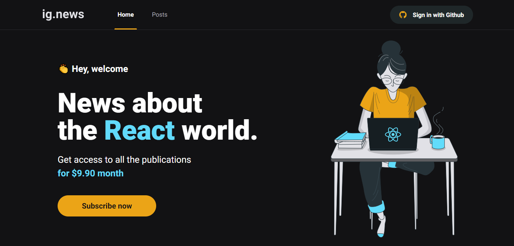

Projeto Web desenvolvido durante o Bootcamp Ignite by Rocketseat • Trilha ReactJS - TEMA: "Ig.News" 📰⚛️

### Descrição:

O projeto trata-se de um blog onde os usuários terão acesso completo aos conteúdos de acordo com o status da sua assinatura mensal. É uma aplicação Serverless, ou seja, todo o processo que dependeria de um backend próprio foi integrado dentro do front-end seguindo o padrão da JAMStack.

- [x] Integração e Consumo de postagens via Prismic CMS;
- [x] Realização de assinatura mensal via Stripe;
- [x] Autenticação dos usuários via Github OAuth;
- [x] Dados salvos no Banco de dados FaunaDB;
- [x] Layout responsivo (mobile e desktop).

## Tecnologias utilizadas: 🚀

- ReactJs | ^18.2.0
- NextJs | ^13.4.19
- Next Auth | ^4.23.1
- Typescript | ^^5.2.2
- SASS | ^1.66.1
- Prismic IO Client | 5.1.1
- Stripe | ^13.4.0
- Fauna DB | ^4.5.2
- Jest | ^28.1.3 -D
- Testing Library | ^12.1.5 -D


## Instalação em sua máquina ⚙️

```
# Clone o projeto e acesse a pasta:
$ git clone https://github.com/Luancss/Ignews && cd ignews

# Instale as dependências:
$ yarn

# Na raiz do projeto crie uma copia do arquivo .env.sample
# Altere o nome da copia para .env.local
# Preencha as variáveis ambiente de acordo com as instruções do arquivo 'servicesConfig' localizado na raiz do projeto

# Execute stripe listen para ouvir eventos do webhook:
$ stripe listen --forward-to localhost:3000/api/webhooks

# Rode o projeto: 
$ yarn dev

# Para rodar os testes automatizados: 
$ yarn test

// A aplicação estará disponível em seu navegador em http://localhost:3000

```
## Dados de testes do Checkout 🧪

- Pagamento bem-sucedido: 4242 4242 4242 4242
- Falha no pagamento: 4000 0000 0000 9995
- Precisa de autenticação: 4000 0025 0000 3155

## Layout (by @tiagoluchtenberg) 🤩

### Desktop (screenshot):

| Home  | Post List | 
| --- | --- |
|  |  | 

| Post Preview | Checkout |
| --- | --- |
|  |  |

### Mobile (screenshot):

| Home | Post List | Post | Checkout |
| --- | --- | --- | --- |
|  |  |  |  |

### Dê uma olhada como o projeto ficou! 👀

...

<br>


